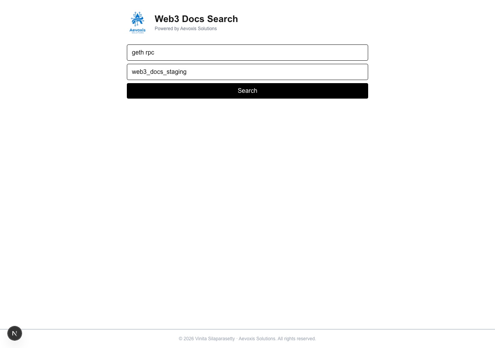
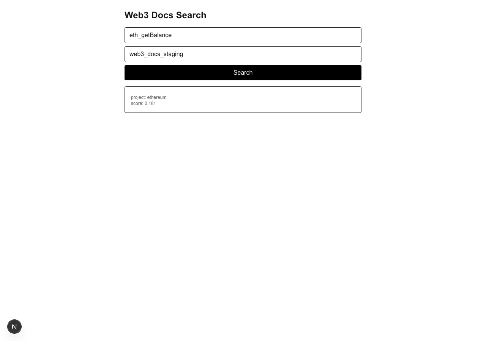
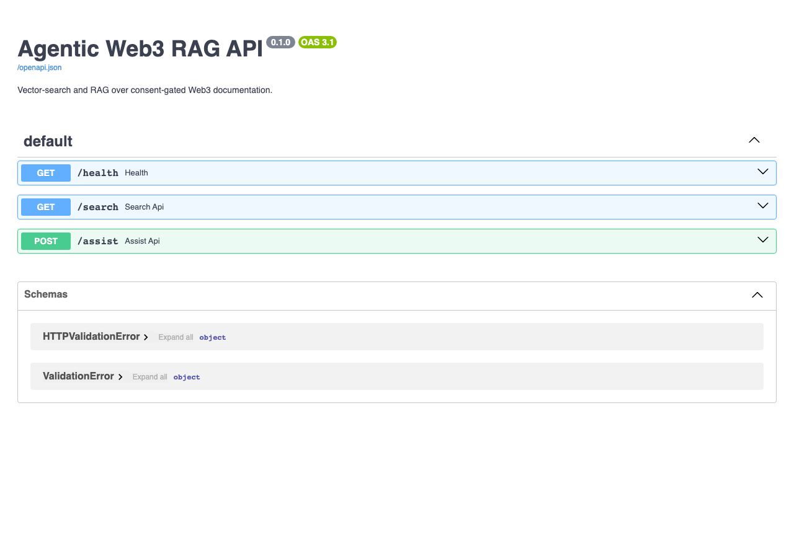

<div align="center">

# 🔍 agentic-web3-rag

**Semantic search and AI-assisted answers over consent-gated Web3 documentation.**

[](https://pypi.org/project/agentic-web3-rag/)
[](https://pypi.org/project/agentic-web3-rag/)
[](https://www.gnu.org/licenses/agpl-3.0)
[](https://github.com/VinitaSilaparasetty/agentic-web3-rag/actions/workflows/release.yml)
[](https://github.com/VinitaSilaparasetty/agentic-web3-rag/issues)

---

Ask natural-language questions about Ethereum, Solidity, Geth, and the broader Web3 ecosystem — get structured answers with cited sources, powered by a local embedding model and Qdrant vector search. Every source ingested requires explicit maintainer consent.

[Installation](#installation) · [Quickstart](#quickstart) · [API Reference](#api-reference) · [Architecture](#architecture) · [Configuration](#configuration) · [Contributing](#contributing)

</div>

---

> **Index status — early access:** The search index is currently seeded with a small set of Aevoxis open-source projects. Search results will be sparse until more Web3 projects opt in. See [**Calling all Web3 open-source developers**](#calling-all-web3-open-source-developers) below if you want your project included.

---

## ✨ Features

- **Semantic search** over Web3 docs using `fastembed` + Qdrant (no GPU required)
- **AI-assisted answers** with structured output and cited sources
- **Consent-first ingestion** — only indexes domains with explicit maintainer approval
- **Display policy enforcement** — respects license terms (link-only / snippet / fulltext) per domain
- **FastAPI backend** with OpenAPI docs at `/docs`
- **Next.js web UI** for interactive search
- **CLI entry points** — `web3rag-api` and `web3rag-ingest`
- **Docker Compose** stack for one-command local setup

---

## 📸 Screenshots

<div align="center">

**Web UI — search interface**


**Live search result for `eth_getBalance`**


**OpenAPI interactive docs (`/docs`)**


</div>

---

## 🏗 Architecture

```
┌─────────────────────────────────────────────────────────┐
│                      Web3 Sources                        │
│         (ethereum.org, geth.ethereum.org, …)            │
└────────────────────────┬────────────────────────────────┘
                         │  consent gate (consents.yaml)
                         ▼
┌─────────────────────────────────────────────────────────┐
│                   Ingest Pipeline                        │
│  ingest → preprocess → embed (fastembed) → index        │
│                         │                               │
│              data/processed/   data/vectors/            │
└────────────────────────┬────────────────────────────────┘
                         │
                         ▼
                  ┌─────────────┐
                  │   Qdrant    │  vector store
                  │  :6333      │  (Docker)
                  └──────┬──────┘
                         │
                         ▼
┌─────────────────────────────────────────────────────────┐
│                   FastAPI  :8080                         │
│   GET  /search   — dense vector search + policy filter  │
│   POST /assist   — retrieval + structured answer        │
│   GET  /health   — liveness check                       │
└────────────────────────┬────────────────────────────────┘
                         │
                         ▼
              ┌──────────────────────┐
              │   Next.js Web UI     │
              │      :3000           │
              └──────────────────────┘
```

---

## 📦 Installation

**Requirements:** Python 3.11+, Docker

```bash
pip install agentic-web3-rag
```

With optional OpenAI-powered answers:
```bash
pip install "agentic-web3-rag[openai]"
```

For local development:
```bash
git clone https://github.com/VinitaSilaparasetty/agentic-web3-rag.git
cd agentic-web3-rag
pip install -e ".[dev]"
```

---

## 🚀 Quickstart

### 1. Configure environment

```bash
cp .env.example .env
# Edit .env and fill in your keys:
#   OPENAI_API_KEY=...   (optional — only needed for LLM-assisted answers)
#   GITHUB_TOKEN=...     (optional — raises GitHub API rate limits for discovery)
```

### 2. Start Qdrant

```bash
docker compose up -d qdrant
```

### 3. Run the ingest pipeline

```bash
# Ingest → chunk → embed → index (all four steps)
web3rag-ingest --sources data/sources.yaml
python -m pipelines.preprocess
python -m pipelines.embed
python -m pipelines.index
```

Or use Make:
```bash
make ingest   # runs ingest step
make dev      # creates venv + installs deps
make up       # starts Docker stack
make api      # starts API server
make test     # runs test suite
make eval     # runs retrieval smoke eval
```

### 4. Start the API

```bash
web3rag-api
# → http://localhost:8080
# → http://localhost:8080/docs  (OpenAPI)
```

### 5. (Optional) Start the Web UI

```bash
cd webui
npm install
npm run dev
# → http://localhost:3000
```

---

## 🔌 API Reference

### `GET /health`
Liveness check.
```bash
curl http://localhost:8080/health
# {"ok": true}
```

---

### `GET /search`
Dense vector search over indexed docs.

| Parameter    | Type     | Default | Description                              |
|-------------|----------|---------|------------------------------------------|
| `q`          | `string` | —       | **Required.** Natural-language query     |
| `k`          | `int`    | `5`     | Number of results to return (max 20)     |
| `project`    | `string` | —       | Filter by project (e.g. `ethereum,geth`) |
| `collection` | `string` | —       | Override Qdrant collection name          |
| `offset`     | `int`    | `0`     | Pagination offset                        |

```bash
curl "http://localhost:8080/search?q=how+do+I+call+eth_getBalance&k=3&project=geth"
```

```json
{
  "results": [
    {
      "url": "https://geth.ethereum.org/docs/interacting-with-geth/rpc",
      "title": "Rpc",
      "snippet": "JSON-RPC Server — Interacting with Geth requires sending requests...",
      "score": 0.82,
      "project": "geth",
      "source": "geth.ethereum.org"
    }
  ]
}
```

---

### `POST /assist`
Retrieval-augmented answer with cited sources.

```bash
curl -X POST http://localhost:8080/assist \
  -H "Content-Type: application/json" \
  -d '{"q": "how do I call eth_getBalance in geth", "k": 3}'
```

**Body parameters:**

| Field        | Type     | Default | Description                          |
|-------------|----------|---------|--------------------------------------|
| `q`          | `string` | —       | **Required.** Developer question     |
| `k`          | `int`    | `5`     | Docs to retrieve                     |
| `project`    | `string` | —       | Project filter (`ethereum`, `geth`)  |
| `collection` | `string` | —       | Override Qdrant collection           |
| `offset`     | `int`    | `0`     | Pagination offset                    |

```json
{
  "query": "how do I call eth_getBalance in geth",
  "answer": "### Enable JSON-RPC in geth\n...\n**References**\n- Rpc (geth.ethereum.org) → https://...",
  "results": [...]
}
```

---

## ⚙️ Configuration

All settings are read from environment variables (or `.env`). Copy `.env.example` to get started.

| Variable                    | Default                              | Description                                      |
|----------------------------|--------------------------------------|--------------------------------------------------|
| `QDRANT_URL`               | `http://localhost:6333`              | Qdrant server URL                                |
| `QDRANT_API_KEY`           | —                                    | Qdrant API key (for Qdrant Cloud)                |
| `QDRANT_ALIAS_ACTIVE`      | `web3_docs_active`                   | Active collection alias queried by the API       |
| `QDRANT_COLLECTION_STAGING`| `web3_docs_staging`                  | Staging collection written to by the pipeline    |
| `EMBEDDING_MODEL`          | `sentence-transformers/all-MiniLM-L6-v2` | fastembed model used for indexing and query  |
| `OPENAI_API_KEY`           | —                                    | Enables LLM-assisted answers in `/assist`        |
| `ASSIST_USE_OPENAI`        | `false`                              | Set to `true` to enable OpenAI answers           |
| `ASSIST_OPENAI_MODEL`      | `gpt-4o-mini`                        | OpenAI model for assisted answers                |
| `GITHUB_TOKEN`             | —                                    | Raises GitHub API rate limit for source discovery|
| `USER_AGENT`               | `web3-rag-bot/0.1`                   | HTTP user-agent used during ingestion            |
| `CACHE_POLICY_DEFAULT`     | `link-only`                          | Default display policy for unknown domains       |
| `SNIPPET_CHARS`            | `320`                                | Max characters in returned snippets              |
| `API_HOST`                 | `0.0.0.0`                            | API bind address                                 |
| `API_PORT`                 | `8080`                               | API port                                         |
| `JWT_SECRET`               | `dev-secret-change-me`               | Secret for JWT smoke tokens (change in prod)     |

---

## 📢 Calling all Web3 open-source developers

**The index is open and actively accepting projects.** If you build tools, protocols, or documentation in the Web3 space — wallets, L2s, DeFi primitives, smart contract frameworks, developer tooling — we want to make your docs searchable for developers worldwide.

**What's in it for you:**

- Your project appears in AI-assisted search results for Web3 developers
- Full attribution — every result links back to your repo
- You control your display policy: `link-only`, `snippet`, or `fulltext`
- Free, revocable at any time — no commercial strings attached

**What we need from you:** One GitHub issue. That's it.

<div align="center">

[](https://github.com/VinitaSilaparasetty/agentic-web3-rag/issues/new?template=consent_to_index.md&title=Consent+to+Index%3A+%5Byour-project-name%5D)

</div>

By submitting the form you agree to the [Consent to Index terms](CONSENT.md). Your GitHub account identity and submission timestamp are recorded as the consent record (legally admissible under eIDAS Art. 25(1)). You can revoke at any time by commenting "REVOKE" on your issue or emailing info@aevoxis.de — all indexed content is removed within 48 hours.

**Currently indexed projects** (bootstrap set — Aevoxis OSS):

| Project | Description | License |
|---------|-------------|---------|
| [pr-automation-agent](https://github.com/VinitaSilaparasetty/pr-automation-agent) | Automated PR review and labelling | AGPL-3.0 |
| [spec-drift_chronometer](https://github.com/VinitaSilaparasetty/spec-drift_chronometer) | AI governance / spec-drift detection for Web3 | AGPL-3.0 |
| [agentic-web3-rag](https://github.com/VinitaSilaparasetty/agentic-web3-rag) | This project — Web3 doc search | AGPL-3.0 |
| [multi-agent-audit-poc](https://github.com/VinitaSilaparasetty/multi-agent-audit-poc) | Multi-agent EU AI Act compliance PoC | Proprietary |

*Your project could be next.*

---

## 📋 Adding Your Own Sources

### 1. Get consent from the doc maintainer

Ask the maintainer to submit the opt-in form above, or raise an issue on their repo pointing them to it. Save the link to their consent issue as proof.

### 2. Add the domain to `data/consents.yaml`

```yaml
consents:
  - status: approved
    domain: yourdocs.example.com
    project: yourproject
    proof: "https://github.com/yourorg/yourrepo/issues/123"
    scope:
      include_paths:
        - /docs/
      exclude_paths: []
```

### 3. Add the URL to `data/sources.yaml`

```yaml
sources:
  - kind: website
    id: yourproject-docs
    project: yourproject
    url: https://yourdocs.example.com/docs/
    consent_proof: "https://github.com/yourorg/yourrepo/issues/123"
```

### 4. Re-run the pipeline

```bash
web3rag-ingest --sources data/sources.yaml
python -m pipelines.preprocess
python -m pipelines.embed
python -m pipelines.index
```

---

## 🐳 Docker

A full Docker Compose stack is included:

```bash
docker compose up -d          # starts Qdrant (+ Postgres)
docker compose down -v        # stops and removes volumes
```

To build and run the API in Docker:

```bash
docker build -f infra/docker/api/Dockerfile -t web3rag-api .
docker run -p 8080:8080 --env-file .env web3rag-api
```

---

## 🧪 Testing

```bash
pip install -e ".[dev]"
pytest
```

Run the retrieval smoke eval (requires a running Qdrant with indexed data):

```bash
python -m pipelines.eval_retrieval
```

---

## 📜 Consent, Governance & Compliance

This project operates on a **deny-by-default** consent model:

- Only domains listed as `approved` in `data/consents.yaml` are ever ingested
- Each entry requires a `proof` link (GitHub issue, email, PR) from the maintainer
- Display policy per domain is enforced at query time (`link-only` / `snippet` / `fulltext`)
- Takedown requests are honoured within 48 hours — see [LEGAL.md](LEGAL.md)
- Full policy details in [GOVERNANCE.md](GOVERNANCE.md)

### EU compliance

| Regulation | How it is addressed |
|-----------|-------------------|
| **GDPR** (2016/679) | [PRIVACY.md](PRIVACY.md) — privacy notice, data subject rights, retention policy, third-country transfer disclosure |
| **EU AI Act** (2024/1689) Art. 50 | `/assist` responses carry `"ai_generated": true` and `X-AI-Generated: true` header; integrators must surface this to end users |
| **DSM Copyright Directive** (2019/790) Art. 4 | Consent model is opt-**in** — exceeds the opt-out minimum; `robots.txt` + `X-Robots-Tag: noai` + TDM reservation headers respected |
| **eIDAS** (910/2014) Art. 25 | GitHub issue consent = Simple Electronic Signature; legally admissible as evidence — see [CONSENT.md §9](CONSENT.md) |
| **DSA** (2022/2065) | Micro-enterprise exemption applies; no algorithmic content ranking or advertising |

---

## 🔬 Research

This repository includes an empirical study on AI consent signal adoption in open-source software:

**[Machine-Readable TDM Opt-Out and AI Opt-In Signal Prevalence in Web3 Open-Source Repositories](experiments/ai_consent_audit/data/paper.md)**
— Vinita Silaparasetty, Aevoxis Solutions, 2026

Audits 200 Web3 OSS repos and 200 matched general-OSS repos for machine-readable signals
under EU DSM Directive Art. 4 and EU AI Act Art. 53. Key findings:

- Only **6.5%** of Web3 repos have deployed any DSM Art. 4 opt-out signal
- **27%** have adopted `llms.txt` voluntary opt-in — significantly higher than general OSS (17.5%, p=0.03)
- `tdm-reservation: 1` (the W3C-specified opt-out mechanism) has **0% adoption** in both populations

Dataset and scanner code released under CC0 / AGPL-3.0 in [`experiments/ai_consent_audit/`](experiments/ai_consent_audit/).

---

## 🤝 Contributing

Contributions are welcome. Please open an issue before submitting a large PR.

```bash
git clone https://github.com/VinitaSilaparasetty/agentic-web3-rag.git
cd agentic-web3-rag
pip install -e ".[dev]"
pytest
```

- Bug reports → [open an issue](https://github.com/VinitaSilaparasetty/agentic-web3-rag/issues/new?template=bug_report.md)
- Feature requests → [open an issue](https://github.com/VinitaSilaparasetty/agentic-web3-rag/issues/new?template=feature_request.md)

---

## 💼 Commercial Licensing

This software is licensed under **AGPL-3.0**. For commercial use, enterprise deployment, or white-label licensing:

📧 **info@aevoxis.de**

---

## 📄 License

Copyright © 2026 Vinita Silaparasetty, Aevoxis Solutions.
Licensed under the [GNU Affero General Public License v3.0](LICENSE).
